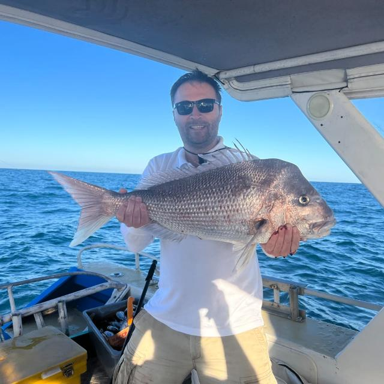

 

<a itemprop="sameAs" content="https://orcid.org/0000-0001-8388-0848" href="https://orcid.org/0000-0001-8388-0848" target="orcid.widget" 
rel="noopener noreferrer" style="vertical-align:top;">
orcid.org/0000-0001-8388-0848</a>
<!-- 
https://research-repository.uwa.edu.au/en/persons/ivica-janekovic/ 
http://www.scopus.com/inward/authorDetails.url?authorID=11539480900&partnerID=8YFLogxK
-->

### About me

I am a physical oceanographer with more than 20y of experience in the observations and modelling space. 
Started my ocean journey after finishing my BSc Physics (field Geophysics, 1997), after followed with MSc
degree in Oceanology (2001) and later PhD in Physics (field of Physical Oceanography, 2007). 
During the 2009 - 2011 I was a postdoctoral scholar at the University of Hawai'i, Manoa (US) working with
[Brian Powell' lab](https://www.soest.hawaii.edu/oceanography/team/brian-powell/) on the 4D-Var Data Assimilation, ROMS nesting and real-time applications in Pacific.

The most of my career I spent in Croatia, working as a Research Scientist (1997 -2009), Research Associate (2011 - 2012), Senior Research Associate (2012 - 2015) and Senior Research Scientist (2015 - 2018) at the 
[Rudjer Boskovic Institute (Croatia)](https://www.irb.hr/eng/Divisions/Division-for-Marine-and-Environmental-Research).
 
During 2015 I moved to Western Australia, UWA, Perth and was appointed as visiting Research Assistant Professor.

Currently, I am working as a [Research Associate Professor](https://research-repository.uwa.edu.au/en/persons/ivica-janekovic) 
at the [Oceans Graduate School, University of Western Australia](https://www.uwa.edu.au/ems/Schools/Oceans-Graduate-School).

Even though my current position at the UWA is research intensive I am still teaching and supervising PhD and MPE students. Recently, I developed (and will start lecturing) unit 
"Modelling in Environmental Engineering" at the UWA and already teaching unit "Numerical modelling in Oceanography" at the University of Zagreb, Croatia.

Working as a physical oceanographer I strive to keep and improve my connections and collaborations across the different groups related to bio-geo-chemical modelling to further
advance interdisciplinary research approach.

For more info see my [Research](Research.md), [Projects](Projects.md) and publications at [Scopus](https://www.scopus.com/authid/detail.uri?authorId=11539480900) or [Google Scolar](https://scholar.google.com/citations?user=LMaKpn0AAAAJ) page.

---

*Ivica Janekovic, PhD*   
*Research Associate Professor*   
*Oceans Graduate School and the Oceans Institute*   
*University of Western Australia*   
   
*ivica dot jan at gmail dot com*   

